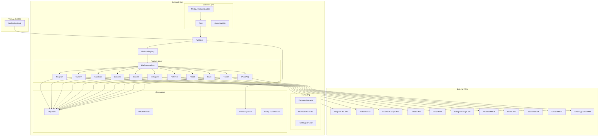
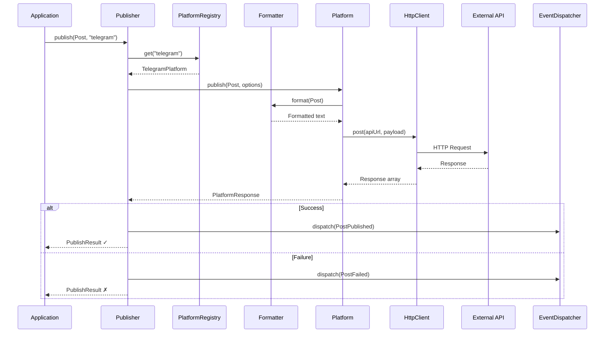
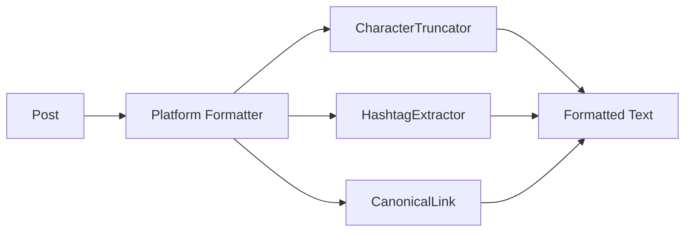
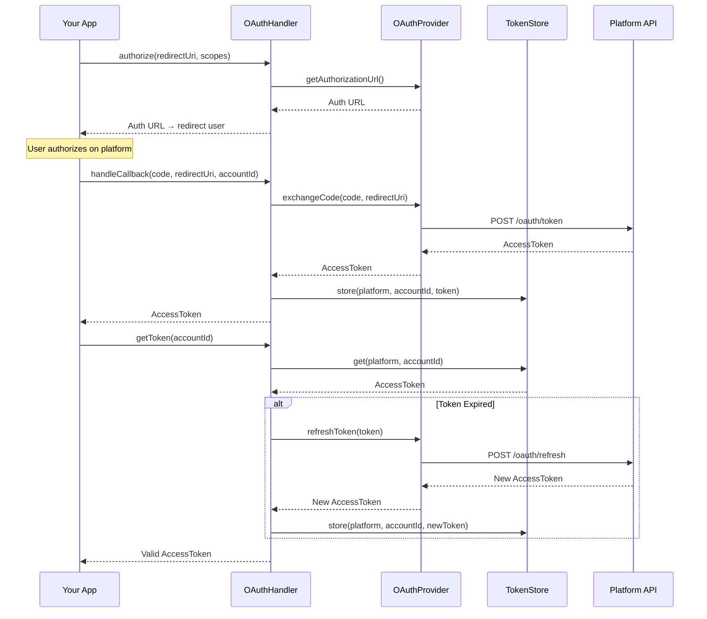
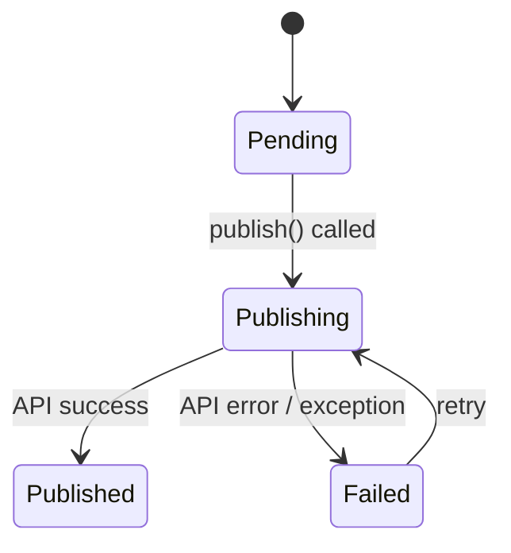
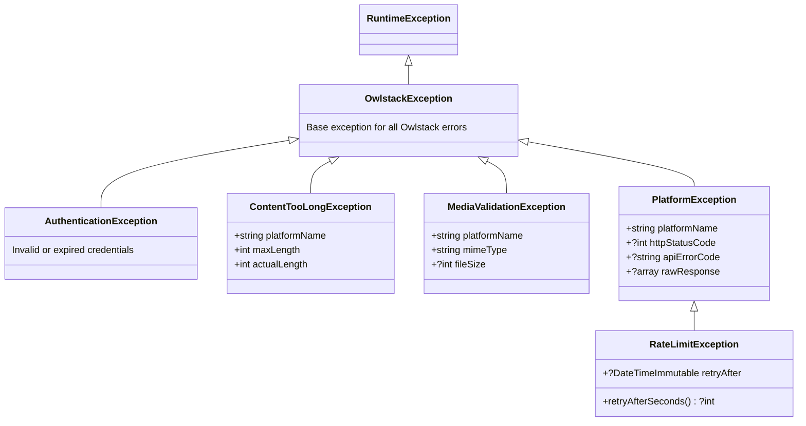

<p align="center">
  <a href="https://owlstack.dev">
    <picture>
      <source media="(prefers-color-scheme: dark)" srcset="https://raw.githubusercontent.com/owlstacks/owlstack-docs/refs/heads/main/static/img/logo-light-transparent.png">
      
    </picture>
  </a>
</p>

<p align="center">
  <strong>Framework-agnostic PHP core for social media publishing</strong>
</p>

<p align="center">
  <a href="https://packagist.org/packages/owlstack/owlstack-core"></a>
  <a href="https://packagist.org/packages/owlstack/owlstack-core"></a>
  <a href="LICENSE"></a>
</p>

---

# Owlstack Core

The shared engine behind [Owlstack](https://owlstack.dev) — publish content to **11 social media platforms** through a single, unified PHP API. Zero framework dependencies. Works with Laravel, WordPress, or standalone.

---

## Table of Contents

- [Why Owlstack Core?](#why-owlstack-core)
- [Supported Platforms](#supported-platforms)
- [Architecture Overview](#architecture-overview)
- [Installation](#installation)
- [Quick Start](#quick-start)
- [Core Concepts](#core-concepts)
  - [Content Model](#content-model)
  - [Media Handling](#media-handling)
  - [Platform Configuration](#platform-configuration)
  - [Publishing](#publishing)
  - [Formatting Pipeline](#formatting-pipeline)
  - [Authentication (OAuth)](#authentication-oauth)
  - [Event System](#event-system)
  - [Delivery Status](#delivery-status)
  - [Error Handling](#error-handling)
  - [HTTP Client](#http-client)
  - [Support Utilities](#support-utilities)
- [Platform Reference](#platform-reference)
- [Multi-Platform Publishing](#multi-platform-publishing)
- [Advanced Usage](#advanced-usage)
- [Testing](#testing)
- [Framework Integrations](#framework-integrations)
- [Contributing](#contributing)
- [Security](#security)
- [License](#license)

---

## Why Owlstack Core?

- **11 platforms, one API** — Telegram, Twitter/X, Facebook, LinkedIn, Discord, Instagram, Pinterest, Reddit, Slack, Tumblr, and WhatsApp
- **Zero dependencies** — Pure PHP 8.1+, only ext-curl and ext-json required
- **Contract-driven** — Every concern (HTTP, storage, events, auth) is backed by an interface
- **Immutable value objects** — `Post`, `Media`, `MediaCollection`, `AccessToken` are all readonly
- **Exception-safe publishing** — `Publisher::publish()` never throws; always returns a `PublishResult`
- **Platform-aware formatting** — Each platform has its own formatter respecting character limits, markup syntax, and media constraints
- **Built for integration** — Designed as the engine for Laravel, WordPress, and Node.js packages

---

## Supported Platforms

| Platform | Max Text | Max Media | Media Types | Notable Features |
|:---------|:---------|:----------|:------------|:-----------------|
| **Telegram** | 4,096 | 10 | JPEG, PNG, GIF, MP4, OGG | Media groups, inline keyboards, location/contact/venue messages |
| **Twitter/X** | 280 | 4 | JPEG, PNG, GIF, MP4 | OAuth 1.0a, polls, quote tweets, exponential backoff retry |
| **Facebook** | 63,206 | 1 | JPEG, PNG, GIF, BMP, MP4, AVI | Graph API, scheduled publishing, privacy targeting |
| **LinkedIn** | 3,000 | 1 | JPEG, PNG, GIF | Personal profiles & company pages, multi-step image upload |
| **Discord** | 2,000 | 10 | JPEG, PNG, GIF, WebP, MP4 | Bot & webhook modes, rich embeds |
| **Instagram** | 2,200 | 10 | JPEG, MP4 | Carousels, Reels, Stories, two-step container publishing |
| **Pinterest** | 800 | — | JPEG, PNG, GIF, WebP, MP4 | Board & section targeting, video pins |
| **Reddit** | 40,000 | 1 | JPEG, PNG, GIF | Self & link posts, flair support, NSFW/spoiler flags |
| **Slack** | 40,000 | — | — | Bot & webhook modes, Block Kit support |
| **Tumblr** | 4,096 | — | — | NPF content blocks, draft/queue/private states |
| **WhatsApp** | 4,096 | — | JPEG, PNG, MP4, PDF, DOCX | Template messages, document sending |

---

## Architecture Overview

Owlstack Core is built on a **contract-driven, layered architecture** with zero framework dependencies. Framework packages (Laravel, WordPress) provide concrete implementations for storage, queues, and events.



<details>
<summary><strong>Publishing Flow</strong></summary>



</details>

---

## Installation

```bash
composer require owlstack/owlstack-core
```

### Requirements

| Requirement | Version |
|:------------|:--------|
| PHP | ≥ 8.1 |
| ext-curl | * |
| ext-json | * |

---

## Quick Start

```php
use Owlstack\Core\Content\Post;
use Owlstack\Core\Content\Media;
use Owlstack\Core\Content\MediaCollection;
use Owlstack\Core\Config\PlatformCredentials;
use Owlstack\Core\Http\HttpClient;
use Owlstack\Core\Platforms\PlatformRegistry;
use Owlstack\Core\Platforms\Telegram\TelegramPlatform;
use Owlstack\Core\Platforms\Telegram\TelegramFormatter;
use Owlstack\Core\Publishing\Publisher;

// 1. Configure credentials
$credentials = new PlatformCredentials('telegram', [
    'api_token' => 'your-bot-token',
    'channel_username' => '@your-channel',
]);

// 2. Create platform
$httpClient  = new HttpClient();
$formatter   = new TelegramFormatter();
$platform    = new TelegramPlatform($credentials, $httpClient, $formatter);

// 3. Register & publish
$registry = new PlatformRegistry();
$registry->register($platform);

$publisher = new Publisher($registry);
$post = new Post(
    title: 'Hello World',
    body: 'My first post via Owlstack!',
    url: 'https://example.com/hello-world',
    tags: ['opensource', 'php'],
);

$result = $publisher->publish($post, 'telegram');

if ($result->success) {
    echo "Published! ID: {$result->externalId}";
    echo "URL: {$result->externalUrl}";
} else {
    echo "Failed: {$result->error}";
}
```

---

## Core Concepts

### Content Model

The content layer uses **immutable value objects** that are platform-agnostic.

#### Post

The central content object. All properties are readonly.

```php
use Owlstack\Core\Content\Post;

$post = new Post(
    title: 'My Article Title',
    body: 'The full article content goes here...',
    url: 'https://example.com/my-article',        // optional
    excerpt: 'A short summary for Twitter',        // optional
    media: $mediaCollection,                       // optional
    tags: ['php', 'social-media', 'automation'],   // optional
    metadata: ['wp_post_id' => 42],                // optional
);

// Helpers
$post->hasMedia();                    // bool
$post->hasUrl();                      // bool
$post->getMeta('wp_post_id');         // 42
$post->getMeta('missing', 'default'); // 'default'
```

| Parameter | Type | Default | Description |
|:----------|:-----|:--------|:------------|
| `title` | `string` | *required* | Post title |
| `body` | `string` | *required* | Post body content |
| `url` | `?string` | `null` | Canonical URL to original content |
| `excerpt` | `?string` | `null` | Short summary (used by Twitter) |
| `media` | `?MediaCollection` | `null` | Attached media files |
| `tags` | `array` | `[]` | Tags for hashtag generation |
| `metadata` | `array` | `[]` | Arbitrary key-value store |

---

### Media Handling

#### Media

A single media attachment (image, video, audio, or document).

```php
use Owlstack\Core\Content\Media;

$image = new Media(
    path: '/path/to/photo.jpg',
    mimeType: 'image/jpeg',
    altText: 'A sunset over the ocean',
    width: 1920,
    height: 1080,
    fileSize: 245_000,
);

$image->isImage();    // true
$image->isVideo();    // false
$image->isAudio();    // false
$image->isDocument(); // false
```

#### MediaCollection

An immutable, typed collection. Adding returns a **new** instance.

```php
use Owlstack\Core\Content\MediaCollection;

$collection = new MediaCollection();
$collection = $collection->add($image1);
$collection = $collection->add($image2);
$collection = $collection->add($video);

$collection->count();    // 3
$collection->first();    // $image1
$collection->images();   // MediaCollection with $image1, $image2
$collection->videos();   // MediaCollection with $video
$collection->isEmpty();  // false
$collection->all();      // Media[]

// Iterable
foreach ($collection as $media) {
    echo $media->path;
}
```

#### CanonicalLink

Appends a "Read more" link to content, respecting character limits.

```php
use Owlstack\Core\Content\CanonicalLink;

$link = new CanonicalLink("\n\nRead more: {url}");
$text = $link->inject($content, 'https://example.com', maxLength: 280);
```

---

### Platform Configuration

#### PlatformCredentials

A readonly credential bag for a single platform.

```php
use Owlstack\Core\Config\PlatformCredentials;

$creds = new PlatformCredentials('twitter', [
    'consumer_key' => '...',
    'consumer_secret' => '...',
    'access_token' => '...',
    'access_token_secret' => '...',
]);

$creds->get('consumer_key');         // value
$creds->has('consumer_key');         // true
$creds->require('consumer_key');     // value or throws InvalidArgumentException
$creds->all();                       // full credentials array
```

#### OwlstackConfig

Central configuration for multiple platforms.

```php
use Owlstack\Core\Config\OwlstackConfig;

$config = new OwlstackConfig(
    platforms: [
        'telegram' => ['api_token' => '...'],
        'twitter'  => ['consumer_key' => '...', /* ... */],
    ],
    options: [
        'default_hashtag_count' => 5,
    ],
);

$config->hasPlatform('telegram');    // true
$config->credentials('telegram');    // PlatformCredentials
$config->configuredPlatforms();      // ['telegram', 'twitter']
$config->option('default_hashtag_count'); // 5
```

#### ConfigValidator

Validates that required credential keys are present for each platform.

```php
use Owlstack\Core\Config\ConfigValidator;

$validator = new ConfigValidator();
$missing = $validator->validate($credentials); // ['access_token_secret']

// Or validate all platforms at once (throws on failure)
$validator->validateConfig($config);
```

<details>
<summary><strong>Required credentials per platform</strong></summary>

| Platform | Required Keys |
|:---------|:-------------|
| Telegram | `api_token` |
| Twitter/X | `consumer_key`, `consumer_secret`, `access_token`, `access_token_secret` |
| Facebook | `app_id`, `app_secret`, `page_access_token`, `page_id` |
| LinkedIn | `access_token`, `person_id` or `organization_id` |
| Discord | `bot_token` + `channel_id`, **or** `webhook_url` |
| Instagram | `access_token`, `instagram_account_id` |
| Pinterest | `access_token`, `board_id` |
| Reddit | `client_id`, `client_secret`, `access_token`, `username` |
| Slack | `bot_token` + `channel`, **or** `webhook_url` |
| Tumblr | `access_token`, `blog_identifier` |
| WhatsApp | `access_token`, `phone_number_id` |

</details>

---

### Publishing

#### Publisher

The main orchestrator. Resolves the platform, publishes, dispatches events, and returns a result — **never throws exceptions**.

```php
use Owlstack\Core\Publishing\Publisher;

$publisher = new Publisher($registry, $eventDispatcher); // dispatcher is optional

$result = $publisher->publish($post, 'telegram', ['chat_id' => '@channel']);
```

#### PublishResult

An immutable result object returned from every publish call.

```php
$result->success;       // bool
$result->failed();      // bool (inverse of success)
$result->platformName;  // 'telegram'
$result->externalId;    // '12345' or null
$result->externalUrl;   // 'https://t.me/channel/12345' or null
$result->error;         // 'Rate limit exceeded' or null
$result->timestamp;     // DateTimeImmutable
```

---

### Formatting Pipeline

Each platform has a dedicated formatter implementing `FormatterInterface`. Formatters handle:

- **Character limits** — Truncating content to platform maximums
- **Markup syntax** — HTML for Telegram, Markdown for Discord/Reddit, mrkdwn for Slack
- **Hashtag injection** — Appending tags within the character budget
- **URL handling** — Platform-specific link formatting (t.co wrapping for Twitter, `<url|text>` for Slack)

```php
use Owlstack\Core\Formatting\Contracts\FormatterInterface;

// Every formatter implements:
$formatter->format($post, $options);  // Formatted string
$formatter->platform();               // 'telegram'
$formatter->maxLength();              // 4096
```

#### CharacterTruncator

Word-boundary-aware text truncation.

```php
use Owlstack\Core\Formatting\CharacterTruncator;

$truncator = new CharacterTruncator(ellipsis: '…');
$truncator->truncate('Hello World', maxLength: 8); // 'Hello…'
```

#### HashtagExtractor

Converts tags to hashtag strings, sanitizing special characters.

```php
use Owlstack\Core\Formatting\HashtagExtractor;

$extractor = new HashtagExtractor();
$extractor->extract(['PHP', 'social media'], maxCount: 5);
// '#PHP #socialmedia'
```



---

### Authentication (OAuth)

The auth layer provides contracts for OAuth flows. Framework packages supply concrete implementations for token storage.

```php
use Owlstack\Core\Auth\OAuthHandler;
use Owlstack\Core\Auth\AccessToken;

// Set up handler (provider & store are interface implementations)
$handler = new OAuthHandler($provider, $tokenStore, 'twitter');

// Step 1: Generate authorization URL
$authUrl = $handler->authorize('https://app.com/callback', ['tweet.read', 'tweet.write']);

// Step 2: Handle callback after user authorizes
$token = $handler->handleCallback($code, 'https://app.com/callback', 'user-123');

// Step 3: Get valid token (auto-refreshes if expired)
$token = $handler->getToken('user-123');
```

#### AccessToken

```php
$token = new AccessToken(
    token: 'abc123',
    refreshToken: 'refresh_xyz',
    expiresAt: new DateTimeImmutable('+1 hour'),
    scopes: ['tweet.read', 'tweet.write'],
    metadata: ['user_id' => '12345'],
);

$token->isExpired();     // false
$token->isRefreshable(); // true
```



---

### Event System

Hook into the publish lifecycle with the event dispatcher.

```php
use Owlstack\Core\Events\Contracts\EventDispatcherInterface;
use Owlstack\Core\Events\PostPublished;
use Owlstack\Core\Events\PostFailed;

class MyDispatcher implements EventDispatcherInterface
{
    public function dispatch(object $event): void
    {
        match (true) {
            $event instanceof PostPublished => $this->onPublished($event),
            $event instanceof PostFailed    => $this->onFailed($event),
        };
    }

    private function onPublished(PostPublished $event): void
    {
        // $event->post — the Post object
        // $event->result — the PublishResult
        logger("Published to {$event->result->platformName}");
    }

    private function onFailed(PostFailed $event): void
    {
        logger("Failed: {$event->result->error}");
    }
}

$publisher = new Publisher($registry, new MyDispatcher());
```

---

### Delivery Status

A PHP 8.1 backed enum for tracking delivery lifecycle in your storage layer.

```php
use Owlstack\Core\Delivery\DeliveryStatus;

$status = DeliveryStatus::Pending;     // 'pending'
$status = DeliveryStatus::Publishing;  // 'publishing'
$status = DeliveryStatus::Published;   // 'published'
$status = DeliveryStatus::Failed;      // 'failed'
```



---

### Error Handling

Owlstack Core uses a structured exception hierarchy. The `Publisher` catches all exceptions internally, but you can handle them directly when calling platform methods.



```php
use Owlstack\Core\Exceptions\RateLimitException;
use Owlstack\Core\Exceptions\ContentTooLongException;
use Owlstack\Core\Exceptions\MediaValidationException;

try {
    $response = $platform->publish($post);
} catch (RateLimitException $e) {
    $seconds = $e->retryAfterSeconds();
    sleep($seconds ?? 60);
    // retry...
} catch (ContentTooLongException $e) {
    echo "Content is {$e->actualLength} chars, max is {$e->maxLength} for {$e->platformName}";
} catch (MediaValidationException $e) {
    echo "Invalid media: {$e->mimeType} not supported on {$e->platformName}";
}
```

---

### HTTP Client

A zero-dependency cURL-based HTTP client.

```php
use Owlstack\Core\Http\HttpClient;

$client = new HttpClient(
    timeout: 30,
    connectTimeout: 10,
    verifySsl: true,
    proxy: [
        'host' => 'proxy.example.com',
        'port' => 8080,
        'type' => CURLPROXY_HTTP,
        'auth' => 'user:pass',
    ],
);

// JSON request
$response = $client->post('https://api.example.com/posts', [
    'headers' => ['Authorization' => 'Bearer token'],
    'json' => ['message' => 'Hello'],
]);

// Multipart file upload
$response = $client->post('https://api.example.com/upload', [
    'multipart' => [
        ['name' => 'file', 'contents' => '/path/to/file.jpg', 'filename' => 'photo.jpg'],
    ],
]);

// $response = ['status' => 200, 'headers' => [...], 'body' => '...']
```

Supported options: `headers`, `json`, `body`, `form_params`, `multipart`, `query`.

---

### Support Utilities

#### Arr — Array Helpers

```php
use Owlstack\Core\Support\Arr;

Arr::get($data, 'user.profile.name', 'Unknown'); // Dot-notation access
Arr::filterEmpty(['a' => 1, 'b' => null, 'c' => '']); // ['a' => 1]
Arr::only($data, ['name', 'email']); // Whitelist keys
```

#### Str — String Helpers

```php
use Owlstack\Core\Support\Str;

Str::limit('Hello World', 8, '…'); // 'Hello…'
Str::slug('My Article Title');      // 'my-article-title'
Str::startsWith('Hello', 'He');    // true
```

#### Clock — Testable Time

```php
use Owlstack\Core\Support\Clock;

Clock::now();        // DateTimeImmutable
Clock::timestamp();  // int

// In tests: freeze time
Clock::freeze(new DateTimeImmutable('2025-01-01 12:00:00'));
Clock::now(); // always 2025-01-01 12:00:00
Clock::unfreeze();
```

---

## Platform Reference

### Telegram

```php
$credentials = new PlatformCredentials('telegram', [
    'api_token' => 'your-bot-token',
    'channel_username' => '@your-channel',
]);

$platform = new TelegramPlatform($credentials, new HttpClient(), new TelegramFormatter());

// Publish with options
$result = $publisher->publish($post, 'telegram', [
    'chat_id' => '@specific-channel',
    'parse_mode' => 'HTML',
    'disable_notification' => true,
    'inline_keyboard' => [
        [['text' => 'Visit Site', 'url' => 'https://example.com']],
    ],
]);

// Extended methods
$platform->sendLocation($chatId, 40.7128, -74.0060);
$platform->sendVenue($chatId, 40.7128, -74.0060, 'NYC Office', '123 Main St');
$platform->sendContact($chatId, '+1234567890', 'John');
$platform->pinMessage($chatId, $messageId);
```

### Twitter/X

```php
$credentials = new PlatformCredentials('twitter', [
    'consumer_key' => '...',
    'consumer_secret' => '...',
    'access_token' => '...',
    'access_token_secret' => '...',
]);

$result = $publisher->publish($post, 'twitter', [
    'reply_to' => '1234567890',
    'quote_tweet_id' => '9876543210',
    'poll' => [
        'options' => ['Yes', 'No', 'Maybe'],
        'duration_minutes' => 1440,
    ],
]);
```

> **Note:** Twitter automatically wraps URLs to 23 characters (t.co). The formatter accounts for this in the character budget.

### Facebook

```php
$credentials = new PlatformCredentials('facebook', [
    'app_id' => '...',
    'app_secret' => '...',
    'page_access_token' => '...',
    'page_id' => '...',
]);

$result = $publisher->publish($post, 'facebook', [
    'privacy' => ['value' => 'EVERYONE'],
    'scheduled_publish_time' => time() + 3600,
]);
```

### LinkedIn

```php
// Personal profile
$credentials = new PlatformCredentials('linkedin', [
    'access_token' => '...',
    'person_id' => 'abc123',
]);

// Or company page
$credentials = new PlatformCredentials('linkedin', [
    'access_token' => '...',
    'organization_id' => 'org456',
]);

$result = $publisher->publish($post, 'linkedin', [
    'visibility' => 'PUBLIC',
]);
```

### Discord

```php
// Bot mode
$credentials = new PlatformCredentials('discord', [
    'bot_token' => '...',
    'channel_id' => '...',
]);

// Or webhook mode
$credentials = new PlatformCredentials('discord', [
    'webhook_url' => 'https://discord.com/api/webhooks/...',
]);

$result = $publisher->publish($post, 'discord', [
    'embed' => true,      // Rich embed with title, description, color
    'color' => 0x5865F2,  // Embed color
    'thread_id' => '...',
    'tts' => false,
]);
```

### Instagram

```php
$credentials = new PlatformCredentials('instagram', [
    'access_token' => '...',
    'instagram_account_id' => '...',
]);

$result = $publisher->publish($post, 'instagram', [
    'media_type' => 'IMAGE',    // IMAGE, REELS, or STORIES
    'image_url' => 'https://example.com/photo.jpg',
    'location_id' => '...',
    'alt_text' => 'Photo description',
    // Carousel
    'carousel' => [
        ['image_url' => 'https://example.com/1.jpg'],
        ['image_url' => 'https://example.com/2.jpg'],
    ],
]);
```

> **Note:** Instagram requires media to be hosted at publicly accessible URLs.

### Pinterest

```php
$credentials = new PlatformCredentials('pinterest', [
    'access_token' => '...',
    'board_id' => '...',
]);

$result = $publisher->publish($post, 'pinterest', [
    'board_section_id' => '...',
    'image_url' => 'https://example.com/pin.jpg',
    'alt_text' => 'Pin description',
    'dominant_color' => '#FF5733',
]);
```

### Reddit

```php
$credentials = new PlatformCredentials('reddit', [
    'client_id' => '...',
    'client_secret' => '...',
    'access_token' => '...',
    'username' => 'your_username',
]);

$result = $publisher->publish($post, 'reddit', [
    'subreddit' => 'php',          // required
    'kind' => 'self',              // 'self' or 'link'
    'flair_id' => '...',
    'nsfw' => false,
    'spoiler' => false,
]);
```

### Slack

```php
// Bot token mode
$credentials = new PlatformCredentials('slack', [
    'bot_token' => 'xoxb-...',
    'channel' => '#general',
]);

// Or webhook mode
$credentials = new PlatformCredentials('slack', [
    'webhook_url' => 'https://hooks.slack.com/services/...',
]);

$result = $publisher->publish($post, 'slack', [
    'blocks' => true,          // Use Block Kit layout
    'thread_ts' => '...',      // Reply in thread
    'unfurl_links' => true,
]);
```

### Tumblr

```php
$credentials = new PlatformCredentials('tumblr', [
    'access_token' => '...',
    'blog_identifier' => 'myblog.tumblr.com',
]);

$result = $publisher->publish($post, 'tumblr', [
    'post_type' => 'text',     // text, image, video, link, audio
    'state' => 'published',    // published, draft, queue, private
    'slug' => 'my-post-slug',
]);
```

### WhatsApp

```php
$credentials = new PlatformCredentials('whatsapp', [
    'access_token' => '...',
    'phone_number_id' => '...',
]);

$result = $publisher->publish($post, 'whatsapp', [
    'to' => '+1234567890',              // required, E.164 format
    'message_type' => 'text',           // text, image, video, document, template
    'template_name' => 'hello_world',   // for template messages
    'template_lang' => 'en_US',
    'preview_url' => true,
]);
```

---

## Multi-Platform Publishing

```php
$registry = new PlatformRegistry();
$registry->register($telegramPlatform);
$registry->register($twitterPlatform);
$registry->register($discordPlatform);

$publisher = new Publisher($registry);

$post = new Post(
    title: 'New Release: v2.0',
    body: 'We are excited to announce version 2.0 with multi-platform support!',
    url: 'https://example.com/releases/v2',
    tags: ['release', 'opensource'],
);

// Publish to all registered platforms
$results = [];
foreach ($registry->names() as $name) {
    $results[$name] = $publisher->publish($post, $name);
}

// Check results
foreach ($results as $platform => $result) {
    echo $result->success
        ? "✓ {$platform}: {$result->externalUrl}\n"
        : "✗ {$platform}: {$result->error}\n";
}
```

---

## Advanced Usage

### Custom Platform

Implement `PlatformInterface` to add a new platform:

```php
use Owlstack\Core\Platforms\Contracts\PlatformInterface;
use Owlstack\Core\Platforms\Contracts\PlatformResponseInterface;
use Owlstack\Core\Platforms\PlatformResponse;
use Owlstack\Core\Content\Post;

class MastodonPlatform implements PlatformInterface
{
    public function name(): string
    {
        return 'mastodon';
    }

    public function publish(Post $post, array $options = []): PlatformResponseInterface
    {
        // Your implementation...
        return PlatformResponse::success(
            externalId: '12345',
            externalUrl: 'https://mastodon.social/@user/12345',
            rawResponse: $apiResponse,
        );
    }

    public function delete(string $externalId): bool
    {
        // Your implementation...
        return true;
    }

    public function validateCredentials(): bool
    {
        // Your implementation...
        return true;
    }

    public function constraints(): array
    {
        return [
            'max_text_length' => 500,
            'max_media_count' => 4,
            'supported_media_types' => ['image/jpeg', 'image/png', 'image/gif'],
            'max_media_size' => 10 * 1024 * 1024,
        ];
    }
}
```

### Custom Formatter

```php
use Owlstack\Core\Formatting\Contracts\FormatterInterface;
use Owlstack\Core\Content\Post;

class MastodonFormatter implements FormatterInterface
{
    public function format(Post $post, array $options = []): string
    {
        // Build formatted content for Mastodon...
        return $formatted;
    }

    public function platform(): string
    {
        return 'mastodon';
    }

    public function maxLength(): int
    {
        return 500;
    }
}
```

### Custom Token Store

```php
use Owlstack\Core\Auth\Contracts\TokenStoreInterface;
use Owlstack\Core\Auth\AccessToken;

class DatabaseTokenStore implements TokenStoreInterface
{
    public function get(string $platform, string $accountId): ?AccessToken { /* ... */ }
    public function store(string $platform, string $accountId, AccessToken $token): void { /* ... */ }
    public function revoke(string $platform, string $accountId): void { /* ... */ }
    public function has(string $platform, string $accountId): bool { /* ... */ }
}
```

### Proxy Configuration

```php
$client = new HttpClient(
    proxy: [
        'host' => 'proxy.example.com',
        'port' => 8080,
        'type' => CURLPROXY_SOCKS5,
        'auth' => 'username:password',
    ],
);
```

---

## Testing

```bash
# Run all tests
composer test

# Run unit tests only
./vendor/bin/phpunit --testsuite Unit

# Run integration tests only
./vendor/bin/phpunit --testsuite Integration
```

The `Clock::freeze()` utility lets you control time in tests:

```php
use Owlstack\Core\Support\Clock;

Clock::freeze(new DateTimeImmutable('2025-06-15 10:00:00'));
// All Clock::now() calls return the frozen time
Clock::unfreeze();
```

---

## Framework Integrations

| Package | Framework | Repository |
|:--------|:----------|:-----------|
| **owlstack/owlstack-laravel** | Laravel 10+ | [owlstack-laravel](https://github.com/owlstack/owlstack-laravel) |
| **owlstack/owlstack-wordpress** | WordPress 6+ | [owlstack-wordpress](https://github.com/owlstack/owlstack-wordpress) |
| **owlstack/owlstack-js-core** | Node.js / JS | [owlstack-js-core](https://github.com/owlstack/owlstack-js-core) |

---

## Contributing

Please see [CONTRIBUTING.md](CONTRIBUTING.md) for details on how to contribute.

## Security

If you discover a security vulnerability, please review [SECURITY.md](SECURITY.md) for reporting instructions.

## License

MIT License. See [LICENSE](LICENSE) for details.

---

<p align="center">
  Built with 🦉 by <a href="https://alihesari.com">Ali Hesari</a>
</p>
